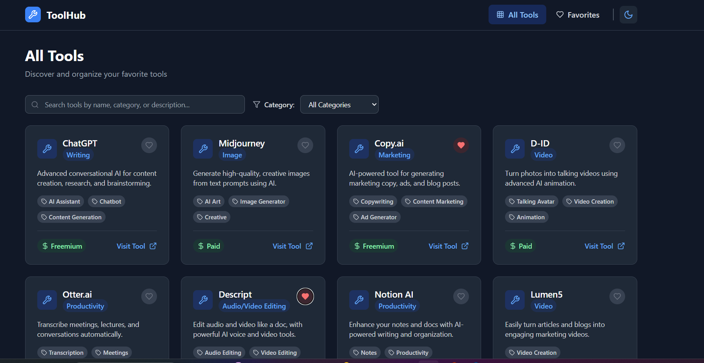
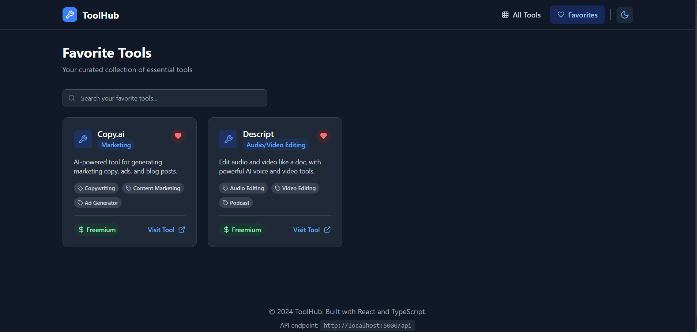
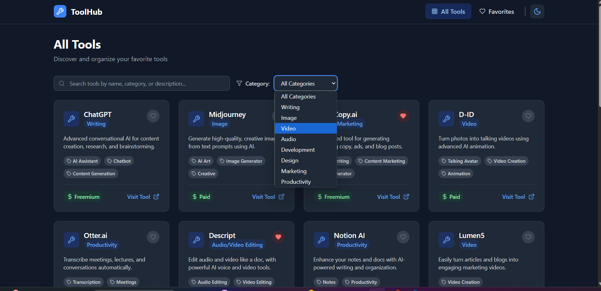
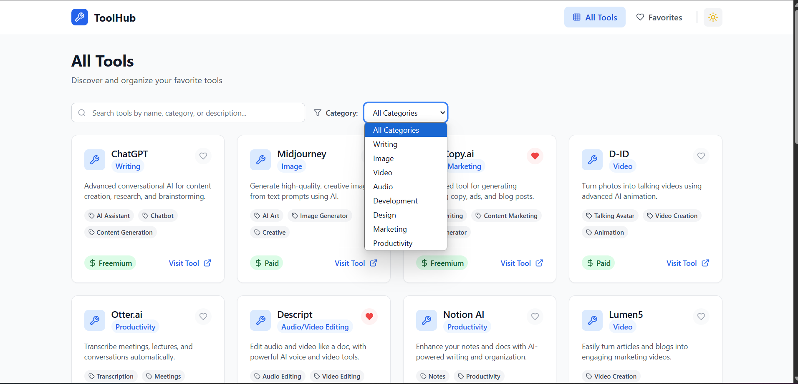
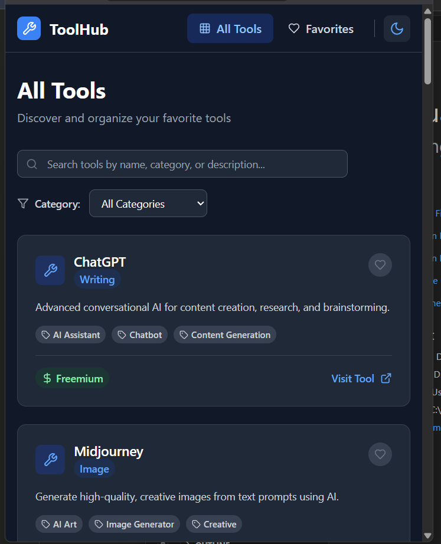

# AI Tools Directory

A full-stack web application for browsing, filtering, and favoriting AI tools.

## Features

- Browse and view AI tools
- Filter tools by category
- Search tools by name
- Add/remove favorites
- Dark mode toggle
- Mobile-friendly design

## How to Run Locally

1. **Clone the repository**
    
    ```bash
    git clone [your-github-repo-url]
    ```
    
2. **Start the backend server**
    
    ```bash
    cd server
    npm i
    node server.js
    ```
    
3. **Start the frontend (in a new terminal)**
    
    ```bash
    cd client
    npm i
    npm run dev
    ```
    


## Screenshots

### All Tools Page



### Favorites Page



### Dark\Light Mode




### Mobile View


